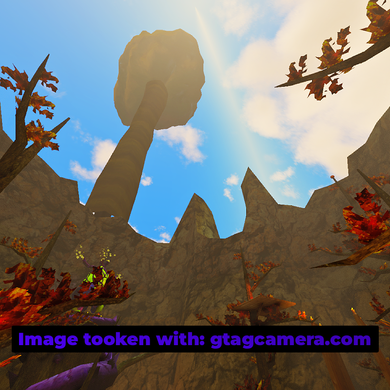

<h1 align="center"> I Hate Aliens</h1>

  
  
  

  A lightweight Gorilla Tag mod that removes the giant alien ship from the sky, along with its sounds and particle effects, while leaving the rest of the alien update untouched.

  

